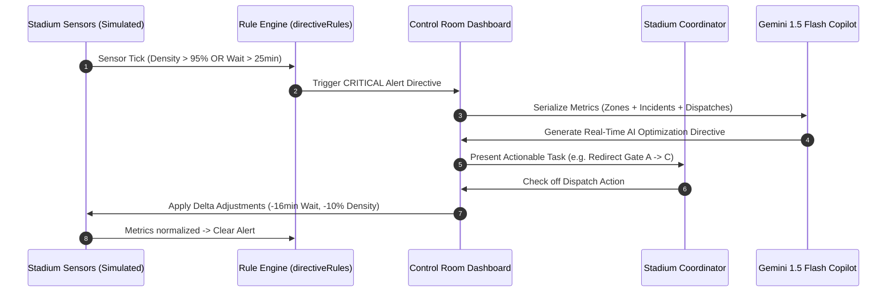

# Architecture & System Design · Stadium Command Center

A deep-dive technical reference on the software architecture, state control loops, Generative AI pipeline, and security model of the **FIFA World Cup 2026 Stadium Command Center**.

---

## 🏛️ High-Level System Architecture

```mermaid
graph TD
    subgraph UI Component Layer
        App[App.jsx - Dashboard Shell]
        StatusBar[StatusBar.jsx - Header & Emergency Control]
        Map[StadiumMap.jsx - Interactive SVG Arena]
        Grid[ZoneGrid.jsx - Zone Telemetry Cards]
        Dispatch[DispatchTaskList.jsx - Dispatch Checklist]
        Copilot[GeminiCopilot.jsx - AI Assistant & Chat]
        Feed[CommandFeed.jsx - Rule Engine Alerts]
        Logger[IncidentReporterPanel.jsx - Incident Form & Log]
    end

    subgraph State Management & Custom Hooks Layer
        useSim[useZoneSimulation - 4s Stochastic Drift Engine]
        useFeed[useDirectiveFeed - Dynamic Rules Evaluator]
        useDispatch[useDispatchActions - Closed-Loop State Mutator]
        useLog[useIncidentLog - Incident Ticket Store]
        useCopilot[useGeminiCopilot - GenAI & Fallback Engine]
        useEmergency[useEmergencyProtocol - Mass Evacuation Controller]
    end

    subgraph Core Utilities & Domain Logic Layer
        RulesEngine[directiveRules.js - Multi-zone Alert Evaluation]
        StatusEngine[zoneStatus.js - Density/Wait Clamping & Derive Status]
        Catalog[zoneCatalog.js & dispatchCatalog.js]
        i18n[dictionaries.js - EN / ES / AR / FR Translations & RTL]
    end

    subgraph External AI Platform Layer
        GeminiAPI[Google Gemini 1.5 Flash API - Client Direct Fetch]
    end

    App --> StatusBar & Map & Grid & Dispatch & Copilot & Feed & Logger
    App --> useSim & useFeed & useDispatch & useLog & useCopilot & useEmergency

    useSim --> StatusEngine
    useFeed --> RulesEngine
    useDispatch --> useSim
    useCopilot --> GeminiAPI
    useCopilot --> i18n
```



---

## 🔄 Closed-Loop Control System Flow

The system operates as a closed-loop feedback control system where physical metrics trigger rules, AI recommends dispatches, human operators execute actions, and actions directly adjust telemetry:



---

## 🛡️ Security & Resilience Layer

| Feature | Implementation | Target Defense |
|---|---|---|
| **Content Security Policy** | HTML `<meta>` header tag | Restricts unauthorized scripts, frames, and inline execution. |
| **Client-Side Key Vault** | Encrypted storage in browser `localStorage` | Prevents API key exposure on central backend servers. |
| **Input Sanitization** | `sanitizeInput()` regex stripper | Neutralizes XSS and prompt injection attacks in AI queries. |
| **Request Throttling** | `AbortController` timeout (30s) | Prevents connection hangs and API rate limit burn. |
| **Error Boundary** | `ErrorBoundary.jsx` React class component | Isolates component rendering exceptions and enables zero-downtime recovery. |

---

## 🌐 Multi-Language & RTL Layout Engine

The application supports 4 languages with native Right-to-Left (RTL) mirroring for Arabic:

```
LTR (English, Spanish, French):   [ Visual Map / Grid ]  |  [ AI Copilot / Feed ]
RTL (Arabic - dir="rtl"):         [ AI Copilot / Feed ]  |  [ Visual Map / Grid ]
```

All spatial flex systems, icons, progress bars, and modal overlays automatically mirror symmetrically without breaking layout responsiveness.
